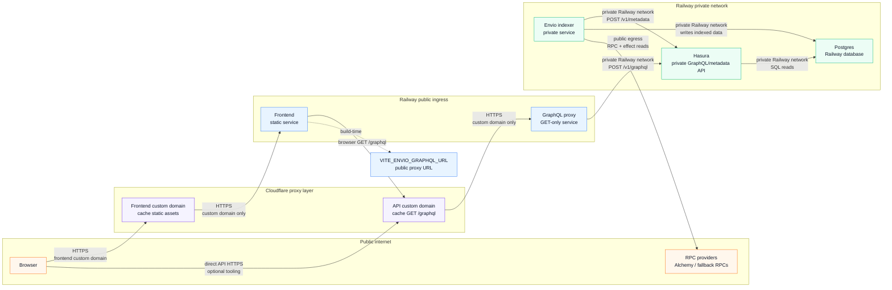

# Railway Self-Hosted Envio Architecture

This project can run the Envio indexer on Railway without Envio Cloud. Railway
config-as-code is service-level: the repo can define build and deploy settings
for each service, but the Railway project, service instances, database service,
domains, and variables still need to exist in Railway.

## Services

Create these Railway services in one project/environment:

| Service         | Source                      | Config file                   | Purpose                                        |
| --------------- | --------------------------- | ----------------------------- | ---------------------------------------------- |
| `Postgres`      | Railway PostgreSQL template | Railway-managed               | Stores Envio indexed state and Hasura metadata |
| `hasura`        | GitHub repo                 | `/railway-hasura.json`        | Serves the private Envio GraphQL API           |
| `graphql-proxy` | GitHub repo                 | `/railway-graphql-proxy.json` | Public GET-only GraphQL proxy                  |
| `indexer`       | GitHub repo                 | `/railway-indexer.json`       | Runs `envio start` and writes to Postgres      |
| `frontend`      | GitHub repo                 | `/railway-frontend.json`      | Optional static frontend service               |

Keep the GraphQL proxy public if the frontend queries it directly, but expose it
through a Cloudflare-proxied custom domain rather than the default
`*.up.railway.app` domain. Hasura can be private because both the indexer and
proxy use Railway private networking to reach it. The indexer does not need a
public domain; Railway can still healthcheck `/ready` on the service port.

The Hasura image binds to `::` so it accepts Railway private-network IPv6
traffic. This matters for legacy Railway environments where
`*.railway.internal` resolves only to IPv6 addresses.

## Architecture



## Variables

Create this shared Railway variable:

```bash
HASURA_GRAPHQL_ADMIN_SECRET=<strong shared secret>
```

Set these variables on `hasura`:

```bash
HASURA_GRAPHQL_DATABASE_URL=${{Postgres.DATABASE_URL}}
HASURA_GRAPHQL_ADMIN_SECRET=${{shared.HASURA_GRAPHQL_ADMIN_SECRET}}
```

`PORT` does not need to be set for `hasura`; the image defaults to `8080`.

Set these variables on `graphql-proxy`:

```bash
HASURA_GRAPHQL_URL=http://${{hasura.RAILWAY_PRIVATE_DOMAIN}}:8080/v1/graphql
# Optional. Defaults to public, s-maxage=60, stale-while-revalidate=300.
GRAPHQL_PROXY_CACHE_CONTROL=
# Optional. Defaults to *.
GRAPHQL_PROXY_CORS_ORIGIN=
# Optional request-size guardrails.
GRAPHQL_PROXY_MAX_URL_LENGTH=
GRAPHQL_PROXY_MAX_QUERY_LENGTH=
GRAPHQL_PROXY_MAX_VARIABLES_LENGTH=
```

`PORT` does not need to be set for `graphql-proxy`; Railway injects it and the
proxy defaults to `8080` outside Railway.

Set these variables on `indexer`:

```bash
DATABASE_URL=${{Postgres.DATABASE_URL}}
HASURA_GRAPHQL_ENDPOINT=http://${{hasura.RAILWAY_PRIVATE_DOMAIN}}:8080/v1/metadata
HASURA_GRAPHQL_ADMIN_SECRET=${{shared.HASURA_GRAPHQL_ADMIN_SECRET}}
# Optional. Defaults to 180000.
ENVIO_HASURA_STARTUP_TIMEOUT_MS=
# Optional. Defaults to true when PORT is set for production `envio start`.
ENVIO_HEALTHCHECK_WRAPPER_ENABLED=
# Optional. Defaults to PORT + 1 when the wrapper is enabled.
ENVIO_INDEXER_INTERNAL_PORT=
# Optional. Leave unset for RPC-only indexing.
ENVIO_API_TOKEN=
# Optional. Defaults to sync without ENVIO_API_TOKEN, or fallback with it.
ENVIO_RPC_MODE=
# Strongly recommended. Public fallback RPCs are unlikely to support production backfill throughput.
ENVIO_RPC_URL_1=<ethereum RPC>
ENVIO_RPC_URL_10=<optimism RPC>
ENVIO_RPC_URL_8453=<base RPC>
ENVIO_RPC_URL_80094=<berachain RPC>
ENVIO_RPC_URL_11155111=<sepolia RPC>
```

`PORT` does not need to be set for `indexer`; Railway injects it, and the
startup wrapper maps it to Envio's internal port handling.

The `ENVIO_RPC_URL_<chainId>` values are technically optional because
`config.yaml` has public fallback RPCs, but production should set them. Public
RPC endpoints are unlikely to sustain the request volume needed for fast
backfills, especially on Berachain and other high-latency chains.

Set this variable on `frontend` if it is deployed on Railway:

```bash
VITE_ENVIO_GRAPHQL_URL=https://<graphql-proxy-public-domain>/graphql
```

If the frontend is hosted elsewhere, use the same public GraphQL proxy URL in
that host's build environment.

For production, use the Cloudflare-proxied API endpoint:

```bash
VITE_ENVIO_GRAPHQL_URL=https://protocol-visualizer-api.olympusdao.finance/graphql
```

If the frontend is also exposed through Cloudflare, set the proxy CORS allowlist
to the frontend custom domain instead of using `*`:

```bash
GRAPHQL_PROXY_CORS_ORIGIN=https://<frontend-custom-domain>
```

## RPC-Only Indexing

`apps/indexer/config.yaml` uses `ENVIO_RPC_MODE` for every RPC source. The
startup wrapper defaults it to `sync` when `ENVIO_API_TOKEN` is absent, which
makes external RPC the historical sync source and avoids HyperSync/Envio Cloud
usage. If `ENVIO_API_TOKEN` is present and `ENVIO_RPC_MODE` is not explicitly
set, the wrapper uses `fallback`, so HyperSync is primary and RPC is fallback.

A cold local RPC-only run reached head for all enabled chains in about eight
minutes. The same run emitted Alchemy compute-unit `429` backoffs on Base,
Optimism, and especially Berachain, so RPC quota and provider throughput are the
main production constraints.

## Deployment Flow

1. Create or attach the Railway `Postgres` template service.
2. Create the Hasura service from the repo and point its config-as-code file at
   `/railway-hasura.json`.
3. Create the GraphQL proxy service from the repo and point its config-as-code
   file at `/railway-graphql-proxy.json`.
4. Create the indexer service from the repo and point its config-as-code file at
   `/railway-indexer.json`.
5. Configure the variables above using Railway variable references for
   `DATABASE_URL`, `HASURA_GRAPHQL_ENDPOINT`, `HASURA_GRAPHQL_URL`, and
   `HASURA_GRAPHQL_ADMIN_SECRET`.
6. Deploy Hasura first, then deploy the GraphQL proxy and indexer. The indexer
   startup wrapper waits for Hasura's metadata endpoint before production
   `envio start`, because Envio's first table-tracking request is not retried if
   Hasura is still refusing private-network connections.
7. Railway healthchecks use the wrapper's `/ready`, which returns `503` until
   Envio reports full indexing readiness from its metrics. The wrapper proxies
   `/healthz`, `/metrics`, and other requests to the internal Envio port.
8. Watch indexer metrics at `/metrics`; readiness is visible through
   `hyperindex_synced_to_head` and `envio_progress_ready{chainId="..."}`.

The indexer wrapper derives `ENVIO_PG_SCHEMA` from `RAILWAY_DEPLOYMENT_ID` when
no schema is set. That keeps preview deployments from writing into the same
schema by accident. For a long-lived production deployment, set
`ENVIO_PG_SCHEMA=public` or another stable schema if you want data to survive
normal redeploys in the same schema.

## Public GraphQL Proxy

The proxy exposes `/graphql` for browser reads. It accepts only GET GraphQL
requests, forwards them to private Hasura as JSON POST requests, supports
introspection, and sets cache headers so Cloudflare can cache successful
responses by URL. `POST` and other non-GET GraphQL requests are rejected at the
proxy. Railway uses `/ready` for proxy healthchecks.

Recommended public networking:

- Remove the default Railway `*.up.railway.app` domain from the GraphQL proxy.
- Keep only the Cloudflare-proxied custom domain, for example
  `protocol-visualizer-api.olympusdao.finance`.
- Keep Hasura private-only on Railway private networking.
- Keep the indexer without a public domain.

Cloudflare should be configured with a
[Cache Rule](https://developers.cloudflare.com/cache/how-to/cache-rules/) for
the proxy GraphQL path, because JSON/API responses are not always cached by
default even when `Cache-Control` is present.

Use this cache rule expression:

```text
http.host eq "protocol-visualizer-api.olympusdao.finance"
and http.request.uri.path eq "/graphql"
and http.request.method eq "GET"
```

Set cache eligibility to cache successful responses and keep the query string in
the [cache key](https://developers.cloudflare.com/cache/how-to/cache-keys/).
The GraphQL request is encoded into the `query` and `variables` parameters, so
ignoring query strings would serve incorrect responses.

Suggested
[WAF custom rule](https://developers.cloudflare.com/waf/custom-rules/) to keep
the public API surface limited to `/graphql`:

```text
http.host eq "protocol-visualizer-api.olympusdao.finance"
and http.request.uri.path ne "/graphql"
```

Optionally block oversized URLs at the edge before they reach Railway:

```text
http.host eq "protocol-visualizer-api.olympusdao.finance"
and len(http.request.uri) gt 32768
```

Suggested API
[rate limiting rule](https://developers.cloudflare.com/waf/rate-limiting-rules/):

- Expression:

  ```text
  (http.request.uri.path eq "/graphql")
  ```

- Counting characteristic: `IP`
- Period: `10 seconds`
- Threshold: `20 requests`
- Mitigation timeout: `10 seconds`
- Action: `Block`

Cloudflare Free rate limiting expressions may be path-limited, so the dashboard
may only allow a path rule such as:

```text
URI Path equals /graphql
```

That applies to any proxied hostname in the `olympusdao.finance` zone using
`/graphql`. That is acceptable if this is the only public `/graphql` endpoint in
the zone; otherwise use a plan/rule that can include host matching or move the
proxy to a more specific path.

The production setup should remove the default Railway public domain, keep
Hasura private, avoid requiring a proxy-origin-secret header, and rely on
Cloudflare caching for successful GET responses. A proxy-origin-secret header is
still a useful defense-in-depth option if the default Railway domain is ever
reintroduced or another direct-origin route becomes available. Configure that
with a Cloudflare
[Request Header Transform Rule](https://developers.cloudflare.com/rules/transform/request-header-modification/).

## Public Frontend

The frontend can also sit behind a Cloudflare-proxied custom domain. This is
recommended for consistent TLS, static asset caching, and edge-level abuse
controls.

Suggested frontend configuration:

- Add a Railway custom domain for the frontend service.
- Add the matching Cloudflare DNS record and keep it proxied.
- Configure the frontend build with
  `VITE_ENVIO_GRAPHQL_URL=https://protocol-visualizer-api.olympusdao.finance/graphql`.
- Cache hashed static assets aggressively, such as `/assets/*`.
- Avoid long edge TTLs for `index.html` unless delayed deploy visibility is
  acceptable.
