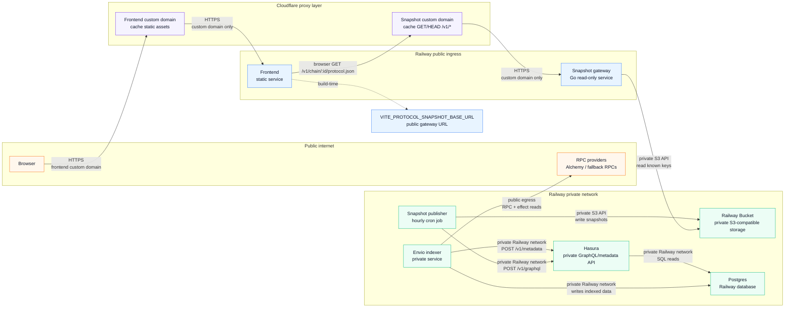

# Railway Self-Hosted Envio Architecture

This project can run the Envio indexer on Railway without Envio Cloud. Railway
config-as-code is service-level: the repo defines build and deploy settings, but
the Railway project, service instances, bucket, domains, and variables still
need to exist in Railway.

## Services

Create these Railway services in one project/environment:

| Service              | Source                      | Config file                         | Purpose                                        |
| -------------------- | --------------------------- | ----------------------------------- | ---------------------------------------------- |
| `Postgres`           | Railway PostgreSQL template | Railway-managed                     | Stores Envio indexed state and Hasura metadata |
| `hasura`             | GitHub repo                 | `/railway-hasura.json`              | Serves the private Envio GraphQL API           |
| `indexer`            | GitHub repo                 | `/railway-indexer.json`             | Runs `envio start` and writes to Postgres      |
| `snapshot-publisher` | GitHub repo                 | `/railway-snapshot-publisher.json`  | Hourly cron job that writes JSON snapshots     |
| `snapshot-gateway`   | GitHub repo                 | `/railway-snapshot-gateway.json`    | Public read-only JSON gateway for the bucket   |
| `frontend`           | GitHub repo                 | `/railway-frontend.json`            | Optional static frontend service               |
| Railway Bucket       | Railway storage bucket      | Railway-managed                     | Private S3-compatible snapshot storage         |

Hasura, Postgres, and the indexer stay private. The snapshot gateway is the only
public API service. Railway Buckets are private, so browser access goes through
the gateway instead of directly reading bucket URLs.

Railway references:

- [Storage Buckets](https://docs.railway.com/storage-buckets)
- [Cron Jobs](https://docs.railway.com/reference/cron-jobs)

For a local Railway-like stack with Docker Compose, see
`docs/local-stack.md`. It uses MinIO as the local S3-compatible replacement for
the private Railway Bucket while keeping the same publisher and gateway images.

## Architecture



## Variables

Create this shared Railway variable:

```bash
HASURA_GRAPHQL_ADMIN_SECRET=<strong shared secret>
```

Set these variables on `hasura`:

```bash
HASURA_GRAPHQL_DATABASE_URL=${{Postgres.DATABASE_URL}}
HASURA_GRAPHQL_ADMIN_SECRET=${{shared.HASURA_GRAPHQL_ADMIN_SECRET}}
```

`PORT` does not need to be set for `hasura`; the image defaults to `8080`.

Set these variables on `indexer`:

```bash
DATABASE_URL=${{Postgres.DATABASE_URL}}
HASURA_GRAPHQL_ENDPOINT=http://${{hasura.RAILWAY_PRIVATE_DOMAIN}}:8080/v1/metadata
HASURA_GRAPHQL_ADMIN_SECRET=${{shared.HASURA_GRAPHQL_ADMIN_SECRET}}
ENVIO_HASURA_STARTUP_TIMEOUT_MS=
ENVIO_HEALTHCHECK_WRAPPER_ENABLED=
ENVIO_INDEXER_INTERNAL_PORT=
ENVIO_API_TOKEN=
ENVIO_RPC_MODE=
ENVIO_RPC_URL_1=<ethereum RPC>
ENVIO_RPC_URL_10=<optimism RPC>
ENVIO_RPC_URL_42161=<arbitrum RPC>
ENVIO_RPC_URL_8453=<base RPC>
ENVIO_RPC_URL_80094=<berachain RPC>
ENVIO_RPC_URL_11155111=<sepolia RPC>
```

### Snapshot Publisher Variables

Set these required production variables on `snapshot-publisher`:

```bash
HASURA_GRAPHQL_URL=http://${{hasura.RAILWAY_PRIVATE_DOMAIN}}:8080/v1/graphql
HASURA_GRAPHQL_ADMIN_SECRET=${{hasura.HASURA_GRAPHQL_ADMIN_SECRET}}
BUCKET=${{<bucket-service>.BUCKET}}
ACCESS_KEY_ID=${{<bucket-service>.ACCESS_KEY_ID}}
SECRET_ACCESS_KEY=${{<bucket-service>.SECRET_ACCESS_KEY}}
REGION=${{<bucket-service>.REGION}}
ENDPOINT=${{<bucket-service>.ENDPOINT}}
```

Use `BUCKET` for the S3 bucket name. Do not use `RAILWAY_BUCKET_NAME` in the
publisher or gateway S3 client configuration.
`HASURA_GRAPHQL_ADMIN_SECRET` must match the private Hasura service's admin
secret so the publisher can read the protocol tables.

Supported snapshot chains are defined in
`packages/protocol-config/protocol-chains.json`. The publisher Docker image sets
`PROTOCOL_CHAINS_CONFIG_PATH=/app/config/protocol-chains.json`; normally do not
override it on Railway.

Optional publisher variables:

```bash
SNAPSHOT_PUBLIC_BASE_PATH=/v1
SNAPSHOT_CHAIN_IDS=1,10,42161,8453,80094,11155111
```

`SNAPSHOT_PUBLIC_BASE_PATH` defaults to `/v1`. `SNAPSHOT_CHAIN_IDS` should only
be used to publish a subset of the shared chain list; every chain ID must exist
in `protocol-chains.json`.

Local-only publisher variables:

```bash
SNAPSHOT_OUTPUT_DIR=/tmp/protocol-visualizer-snapshots
SNAPSHOT_SOURCE=sample
```

When `SNAPSHOT_OUTPUT_DIR` is set and `SNAPSHOT_SOURCE` is omitted, the
publisher defaults to deterministic sample data and does not require Hasura or
bucket credentials. Use `SNAPSHOT_SOURCE=hasura` with `HASURA_GRAPHQL_URL` and
`HASURA_GRAPHQL_ADMIN_SECRET` to write live Hasura data to local files.

`/railway-snapshot-publisher.json` configures the cron schedule as
`0 * * * *` UTC with `restartPolicyType: NEVER`. Each run starts a container,
publishes one snapshot batch, logs `Snapshot publisher completed successfully;
exiting` on success, and exits.

### Snapshot Gateway Variables

Set the same bucket variables on `snapshot-gateway`:

```bash
BUCKET=${{<bucket-service>.BUCKET}}
ACCESS_KEY_ID=${{<bucket-service>.ACCESS_KEY_ID}}
SECRET_ACCESS_KEY=${{<bucket-service>.SECRET_ACCESS_KEY}}
REGION=${{<bucket-service>.REGION}}
ENDPOINT=${{<bucket-service>.ENDPOINT}}
```

`PORT` does not need to be set for `snapshot-gateway`; Railway injects it and
the gateway defaults to `8080` outside Railway. The gateway uses Go's standard
`net/http` server and no HTTP framework. It sets public read CORS headers for
browser access to the snapshot files. Its `/ready` endpoint returns `200` only
after the service can access `v1/manifest.json` in the Railway Bucket. The
gateway image copies the shared chain config and sets
`PROTOCOL_CHAINS_CONFIG_PATH=/app/config/protocol-chains.json`.

Set this variable on `frontend` if it is deployed on Railway:

```bash
VITE_PROTOCOL_SNAPSHOT_BASE_URL=https://<snapshot-gateway-public-domain>
```

For production, use the Cloudflare-proxied snapshot endpoint:

```bash
VITE_PROTOCOL_SNAPSHOT_BASE_URL=https://protocol-visualizer-api.olympusdao.finance
```

## Public Snapshot Contract

The snapshot gateway exposes only these public paths:

```text
GET /v1/index.html
GET /v1/manifest.json
GET /v1/schemas/manifest-v1.schema.json
GET /v1/schemas/protocol-snapshot-v1.schema.json
GET /v1/chain/{chainId}/protocol.json
```

Supported chain IDs come from `packages/protocol-config/protocol-chains.json`,
which is used by the frontend, publisher, and gateway. The gateway rejects
unknown paths, unsupported chains, request bodies, and methods other than `GET`,
`HEAD`, and preflight `OPTIONS` for allowlisted `/v1/` routes.

Each `protocol.json` file contains:

```json
{
  "schemaVersion": "1.0.0",
  "generatedAt": "2026-05-25T00:00:00.000Z",
  "chainId": 1,
  "recordCounts": {
    "contracts": 0,
    "roles": 0,
    "roleAssignments": 0
  },
  "data": {
    "contracts": [],
    "roles": [],
    "roleAssignments": []
  }
}
```

Future public JSON file types should add their own schema files under
`/v1/schemas/` instead of overloading the protocol snapshot schema.

## Deployment Flow

1. Create or attach the Railway `Postgres` template service.
2. Create the Railway Bucket service for protocol snapshots.
3. Create the Hasura service from the repo and point its config-as-code file at
   `/railway-hasura.json`.
4. Create the indexer service and point its config-as-code file at
   `/railway-indexer.json`.
5. Create the snapshot publisher service and point its config-as-code file at
   `/railway-snapshot-publisher.json`.
6. Create the snapshot gateway service and point its config-as-code file at
   `/railway-snapshot-gateway.json`.
7. Configure variables using Railway variable references for Postgres, Hasura,
   and bucket credentials.
8. Deploy Hasura first, then indexer, then snapshot publisher and gateway.
9. Manually run `snapshot-publisher` once after initial deployment. The
   snapshot gateway healthcheck will remain `503` until `v1/manifest.json` is
   accessible in the bucket. Confirm `/v1/manifest.json` returns `200` through
   the snapshot gateway before switching the frontend build variable to the
   gateway URL.
10. Deploy the frontend with `VITE_PROTOCOL_SNAPSHOT_BASE_URL` set to the
    Cloudflare-proxied snapshot gateway domain.

The publisher is configured as a Railway cron job with `0 * * * *` UTC. Each
run starts the container, regenerates all snapshot files, uploads and verifies
them, writes `manifest.json` last, and exits. If any file cannot be generated,
validated, uploaded, or verified, the process exits non-zero and Railway records
the failed cron run.

## Cloudflare Rules

Put the snapshot gateway behind a Cloudflare-proxied custom domain. Remove the
default Railway public domain after the custom domain is working.

Use this cache rule expression:

```text
http.host eq "protocol-visualizer-api.olympusdao.finance"
and http.request.uri.path starts_with "/v1/"
and http.request.method in {"GET" "HEAD"}
```

Cache JSON and HTML responses from the snapshot gateway. The gateway already
sets route-specific `Cache-Control` headers:

- `/v1/chain/*/protocol.json`: `public, s-maxage=3600, stale-while-revalidate=86400`
- `/v1/manifest.json`: `public, s-maxage=300, stale-while-revalidate=3600`
- `/v1/index.html`: `public, s-maxage=300, stale-while-revalidate=3600`
- `/v1/schemas/*`: `public, max-age=86400, immutable`

Suggested WAF rules:

```text
http.host eq "protocol-visualizer-api.olympusdao.finance"
and not http.request.method in {"GET" "HEAD" "OPTIONS"}
```

```text
http.host eq "protocol-visualizer-api.olympusdao.finance"
and not http.request.uri.path starts_with "/v1/"
```

## Validation

Run the repository validation commands from `AGENTS.md`, plus the snapshot
checks:

```bash
pnpm run check:runtime-versions
pnpm install --frozen-lockfile
pnpm run lint:check
pnpm run build
pnpm run snapshots:generate:local
pnpm run docker:build:indexer
pnpm run docker:build:frontend
pnpm run docker:build:snapshot-gateway
pnpm run docker:build:snapshot-publisher
```

Deployment smoke checks:

```bash
curl -I https://<snapshot-gateway-domain>/v1/manifest.json
curl -I https://<snapshot-gateway-domain>/v1/chain/1/protocol.json
curl https://<snapshot-gateway-domain>/v1/manifest.json
```

Verify `200` responses, expected `Content-Type`, expected `Cache-Control`, and
fresh `generatedAt` timestamps before switching frontend traffic.
