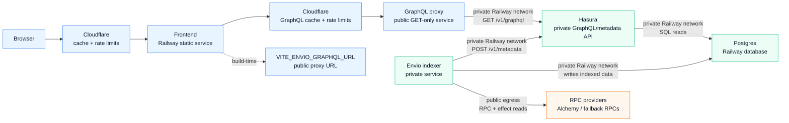

# Railway Self-Hosted Envio Architecture

This project can run the Envio indexer on Railway without Envio Cloud. Railway
config-as-code is service-level: the repo can define build and deploy settings
for each service, but the Railway project, service instances, database service,
domains, and variables still need to exist in Railway.

## Services

Create these Railway services in one project/environment:

| Service                        | Source                      | Config file                   | Purpose                                        |
| ------------------------------ | --------------------------- | ----------------------------- | ---------------------------------------------- |
| `Postgres`                     | Railway PostgreSQL template | Railway-managed               | Stores Envio indexed state and Hasura metadata |
| `protocol-visualizer-hasura`   | GitHub repo                 | `/railway-hasura.json`        | Serves the private Envio GraphQL API           |
| `protocol-visualizer-graphql`  | GitHub repo                 | `/railway-graphql-proxy.json` | Public GET-only GraphQL proxy                  |
| `protocol-visualizer-indexer`  | GitHub repo                 | `/railway-indexer.json`       | Runs `envio start` and writes to Postgres      |
| `protocol-visualizer-frontend` | GitHub repo                 | `/railway-frontend.json`      | Optional static frontend service               |

Keep the GraphQL proxy public if the frontend queries it directly. Hasura can be
private because both the indexer and proxy use Railway private networking to
reach it. The indexer does not need a public domain; Railway can still
healthcheck `/ready` on the service port.

The Hasura image binds to `::` so it accepts Railway private-network IPv6
traffic. This matters for legacy Railway environments where
`*.railway.internal` resolves only to IPv6 addresses.

## Architecture



## Variables

Set these variables on `protocol-visualizer-hasura`:

```bash
PORT=8080
HASURA_GRAPHQL_DATABASE_URL=${{Postgres.DATABASE_URL}}
HASURA_GRAPHQL_ADMIN_SECRET=<strong shared secret>
```

Set these variables on `protocol-visualizer-graphql`:

```bash
PORT=8080
HASURA_GRAPHQL_URL=http://${{protocol-visualizer-hasura.RAILWAY_PRIVATE_DOMAIN}}:8080/v1/graphql
# Optional. Defaults to public, s-maxage=60, stale-while-revalidate=300.
GRAPHQL_PROXY_CACHE_CONTROL=
# Optional. Defaults to *.
GRAPHQL_PROXY_CORS_ORIGIN=
# Optional request-size guardrails.
GRAPHQL_PROXY_MAX_URL_LENGTH=
GRAPHQL_PROXY_MAX_QUERY_LENGTH=
GRAPHQL_PROXY_MAX_VARIABLES_LENGTH=
```

Set these variables on `protocol-visualizer-indexer`:

```bash
PORT=9898
DATABASE_URL=${{Postgres.DATABASE_URL}}
HASURA_GRAPHQL_ENDPOINT=http://${{protocol-visualizer-hasura.RAILWAY_PRIVATE_DOMAIN}}:8080/v1/metadata
HASURA_GRAPHQL_ADMIN_SECRET=${{protocol-visualizer-hasura.HASURA_GRAPHQL_ADMIN_SECRET}}
# Optional. Defaults to 180000.
ENVIO_HASURA_STARTUP_TIMEOUT_MS=
# Optional. Defaults to true when PORT is set for production `envio start`.
ENVIO_HEALTHCHECK_WRAPPER_ENABLED=
# Optional. Defaults to PORT + 1 when the wrapper is enabled.
ENVIO_INDEXER_INTERNAL_PORT=
ENVIO_API_TOKEN=
ENVIO_RPC_MODE=
ENVIO_RPC_URL_1=<ethereum RPC>
ENVIO_RPC_URL_10=<optimism RPC>
ENVIO_RPC_URL_8453=<base RPC>
ENVIO_RPC_URL_80094=<berachain RPC>
ENVIO_RPC_URL_11155111=<sepolia RPC>
```

Set this variable on `protocol-visualizer-frontend` if it is deployed on
Railway:

```bash
VITE_ENVIO_GRAPHQL_URL=https://<graphql-proxy-public-domain>/graphql
```

If the frontend is hosted elsewhere, use the same public GraphQL proxy URL in
that host's build environment.

## RPC-Only Indexing

`apps/indexer/config.yaml` uses `ENVIO_RPC_MODE` for every RPC source. The
startup wrapper defaults it to `sync` when `ENVIO_API_TOKEN` is absent, which
makes external RPC the historical sync source and avoids HyperSync/Envio Cloud
usage. If `ENVIO_API_TOKEN` is present and `ENVIO_RPC_MODE` is not explicitly
set, the wrapper uses `fallback`, so HyperSync is primary and RPC is fallback.

A cold local RPC-only run reached head for all enabled chains in about eight
minutes. The same run emitted Alchemy compute-unit `429` backoffs on Base,
Optimism, and especially Berachain, so RPC quota and provider throughput are the
main production constraints.

## Deployment Flow

1. Create or attach the Railway `Postgres` template service.
2. Create the Hasura service from the repo and point its config-as-code file at
   `/railway-hasura.json`.
3. Create the GraphQL proxy service from the repo and point its config-as-code
   file at `/railway-graphql-proxy.json`.
4. Create the indexer service from the repo and point its config-as-code file at
   `/railway-indexer.json`.
5. Configure the variables above using Railway variable references for
   `DATABASE_URL`, `HASURA_GRAPHQL_ENDPOINT`, `HASURA_GRAPHQL_URL`, and
   `HASURA_GRAPHQL_ADMIN_SECRET`.
6. Deploy Hasura first, then deploy the GraphQL proxy and indexer. The indexer
   startup wrapper waits for Hasura's metadata endpoint before production
   `envio start`, because Envio's first table-tracking request is not retried if
   Hasura is still refusing private-network connections.
7. Railway healthchecks use the wrapper's `/ready`, which returns `503` until
   Envio reports full indexing readiness from its metrics. The wrapper proxies
   `/healthz`, `/metrics`, and other requests to the internal Envio port.
8. Watch indexer metrics at `/metrics`; readiness is visible through
   `hyperindex_synced_to_head` and `envio_progress_ready{chainId="..."}`.

## Public GraphQL Proxy

The proxy exposes `/graphql` and `/v1/graphql` for browser reads. It accepts only
GET GraphQL requests, forwards them to private Hasura, supports introspection,
and sets cache headers so Cloudflare can cache successful responses by URL.
`POST` and other non-GET GraphQL requests are rejected at the proxy. Railway
uses `/ready` for proxy healthchecks.

Cloudflare should be configured with a cache rule for the proxy GraphQL path,
because JSON/API responses are not always cached by default even when
`Cache-Control` is present. Use rate limiting on the same path to control public
traffic spikes.

The indexer wrapper derives `ENVIO_PG_SCHEMA` from `RAILWAY_DEPLOYMENT_ID` when
no schema is set. That keeps preview deployments from writing into the same
schema by accident. For a long-lived production deployment, set
`ENVIO_PG_SCHEMA=public` or another stable schema if you want data to survive
normal redeploys in the same schema.
